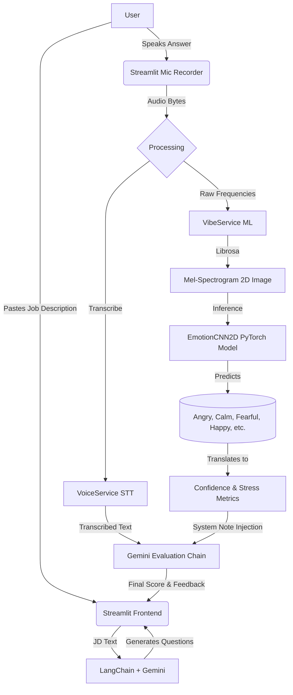

# EchoPrep: AI-Powered Interview Coach
**Presentation Outline & Content**

---

## Slide 1: Introduction
**Title:** EchoPrep - Beyond the Transcript
**Subtitle:** Holistic AI interview preparation using Large Language Models and Real-Time Speech Emotion Recognition.
**Key Point:** EchoPrep doesn't just evaluate *what* you say; it analyzes *how* you say it.

---

## Slide 2: The Problem
**Title:** The Flaw in Modern Interview Prep
* Traditional mock interview bots (like ChatGPT) rely entirely on text transcriptions.
* They evaluate technical accuracy but completely ignore social and emotional cues.
* **The Reality:** A candidate can give a technically perfect answer while sounding terrified or using excessive filler words—and fail the interview.
* **The Goal:** Candidates need a way to practice maintaining a confident "vibe" under pressure, receiving feedback on both their knowledge and their delivery.

---

## Slide 3: The EchoPrep Solution
**Title:** A Dual-Engine Approach
* **Dynamic Generation:** Users provide a Job Description. Our LLM parses it to dynamically generate tailored, role-specific questions.
* **Multimodal Input:** The candidate speaks their answer out loud. We capture the raw audio.
* **Dual Analysis:**
  1. **Text Engine (Gemini):** Evaluates the transcription for technical accuracy and relevance.
  2. **Vibe Engine (PyTorch CNN):** Evaluates the raw audio to detect the candidate's emotional state (Stress, Confidence, Tremors).
* **Holistic Feedback:** The insights are merged. The LLM provides a final score (/10) and feedback that addresses both technical content and emotional presentation.

---

## Slide 4: System Architecture
**Title:** EchoPrep Data Flow



---

## Slide 5: The "Vibe Check" Engine
**Title:** Custom Speech Emotion Recognition
* We trained a custom ~8.7 million parameter 2D Convolutional Neural Network.
* **Dataset:** Trained on the RAVDESS dataset (Ryerson Audio-Visual Database of Emotional Speech and Song).
* **How it works:** We convert audio into 128-band Mel-spectrogram images. The CNN analyzes these visual representations of sound to detect complex harmonic changes associated with human emotion.

**Key Code Snippet (PyTorch Architecture):**
```python
# Adaptive pooling allows our model to process answers of variable lengths
# forces dynamic time-widths into a fixed 8x8 grid for linear evaluation
self.adaptive_pool = nn.AdaptiveAvgPool2d((8, 8))

# Classification Head
self.fc1 = nn.Linear(256 * 8 * 8, 512)
self.fc2 = nn.Linear(512, 128)
self.fc3 = nn.Linear(128, 8) # Maps to 8 specific RAVDESS Emotions
```

---

## Slide 6: Prompt Engineering Integration
**Title:** Merging Models via LangChain
* We inject the mathematical ML metrics into Gemini's evaluation prompt dynamically.

**Key Code Snippet (Prompt Injection):**
```python
EVALUATION_PROMPT = """
You are an expert technical interviewer...
Evaluate the candidate's answer based on the following:

QUESTION: {question}
CANDIDATE'S ANSWER (Transcribed): {candidate_answer}

VIBE CHECK METRICS (From Audio Analysis):
{vibe_metrics}

Generate a Score out of 10 and explicitly provide feedback honoring both the technical answer and the Vibe Check metrics.
"""
```

---

## Slide 7: Team Contributions
*Note: Replace "Member N" with actual names.*

### 🧑‍💻 Member 1: Machine Learning Engineer (Audio Vibe Check)
* Responsible for building the [EmotionCNN2D](file:///c:/Users/navod/Desktop/EchoPrep/ml/ser_model.py#5-106) deep learning model.
* Engineered the data pipeline ([ser_dataset.py](file:///c:/Users/navod/Desktop/EchoPrep/ml/ser_dataset.py)) to parse the RAVDESS dataset and use Librosa to extract Mel-spectrograms.
* Wrote the [train_ser.py](file:///c:/Users/navod/Desktop/EchoPrep/ml/train_ser.py) loop (handling GPU allocation, learning rate scheduling, and validation loss checkpointing) achieving ~95% validation accuracy.

### 🔌 Member 2: Backend Integration & LLM Orchestration
* Responsible for integrating the Gemini 2.5 Flash model specifically using LangChain.
* Engineered the [llm_service.py](file:///c:/Users/navod/Desktop/EchoPrep/llm_service.py) to handle dynamic prompt injection and structured output parsing.
* Built the [vibe_service.py](file:///c:/Users/navod/Desktop/EchoPrep/vibe_service.py) inference pipeline that hooks the live uncompressed audio directly into the PyTorch `.pth` weights to extract runtime scores.

### 🎨 Member 3: Frontend UI / UX Developer
* Built the entire interactive [app.py](file:///c:/Users/navod/Desktop/EchoPrep/app.py) wrapper using Streamlit.
* Implemented the `streamlit-mic-recorder` flow for live browser-based audio capture.
* Designed the "Interview Evaluation Report", coding the dynamic data visualizations (Score Progress Bars, Bar Charts) and chat history components. 

### ⚙️ Member 4: Systems, APIs & DevOps
* Responsible for the [VoiceService](file:///c:/Users/navod/Desktop/EchoPrep/voice_service.py#9-48) integration, handling the complex translation of Speech-to-Text and Text-to-Speech APIs.
* Handled dependency management, fixing PyAudio/PortAudio binary conflicts for local environments.
* Built cross-platform automation scripts ([Makefile](file:///c:/Users/navod/Desktop/EchoPrep/Makefile), [run.sh](file:///c:/Users/navod/Desktop/EchoPrep/run.sh), [run.bat](file:///c:/Users/navod/Desktop/EchoPrep/run.bat)) ensuring the dual AI-engines could spin up in reliable virtual environments across Windows, WSL, and Linux.
